+++
title = "How to Contribute to AORTA"
description = "Instructions for AORTA content contributors."
+++

# How do I contribute to AORTA?

You can contribute in two ways to AORTA:

1. By managing and writing notes for a medical learning objective.
2. By adding extended-matching questions (EMQs) under a learning objective.

Both ways of contributing require you to register an account on AORTA.
Registration is free and doesn't require any information from you except a
username you choose and an optional email. 

Below are instructions for:

1. [Registering an account on AORTA.]()
2. [Adding a learning objective.]()
3. [Editing notes for a learning objective.]()
4. [Adding EMQs.]()

Please note that many of the features are still in beta. If you have any
questions or would like to suggest features that would improve your workflow,
please get in contact with us at contact@cigmah.org.

# How do I register an account on AORTA?

1. Click on the button at the top-right to open the register dialog.
   
    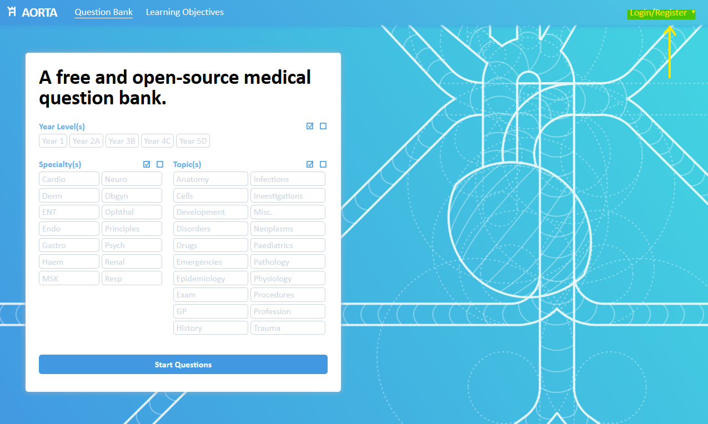

2. Click on the text "Not registered? Click here." to switch to the
   register dialog.

    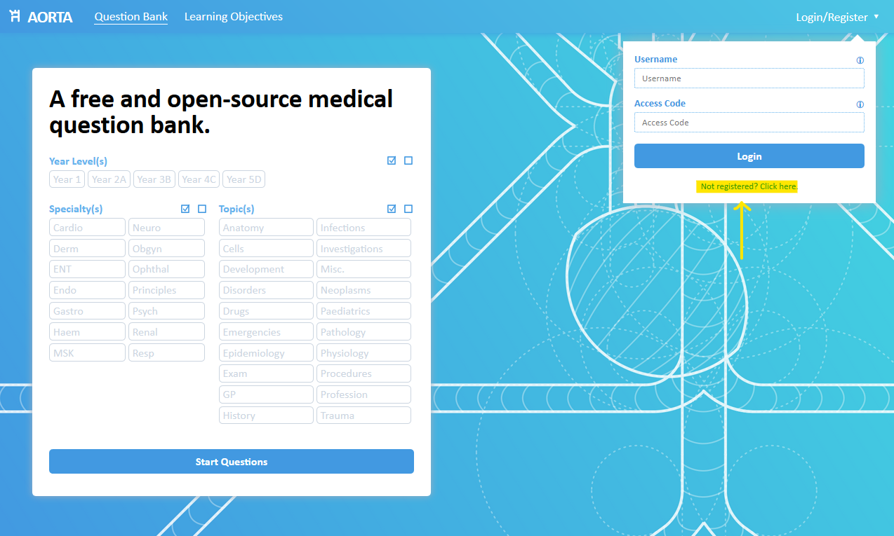
    
3. Enter a new username and an optional email. You can provide an email for
   account recovery if you forget your access code. We do not share or use your
   email for any other purpose.
   
   After you have entered your information, click *Register*. If your username
   is taken, you will be told you need to change it.

    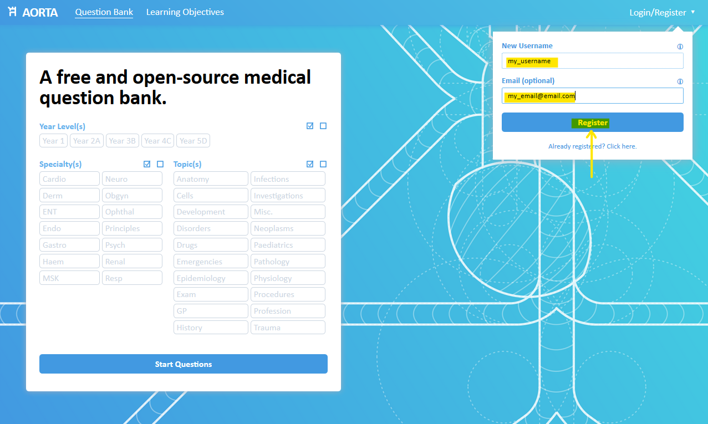
    
4. You will receive an access code. **Keep this access code safe somewhere as it
   will not be shown again**. If you lose your access code, you will need to
   contact us at contact@cigmah.org.
   
   After registering, you are automatically logged in for the first time. For
   future logins, you will need to enter your username and access code into the
   login dialog box.

    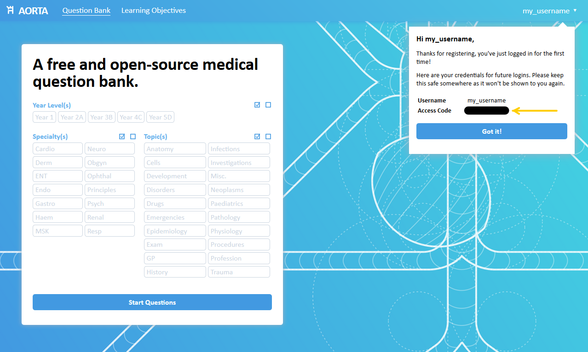

# How do I add a learning objective?

First, make sure you are logged into your account on AORTA.

1. Click on the Learning Objectives navigation button to head to the objectives page.

    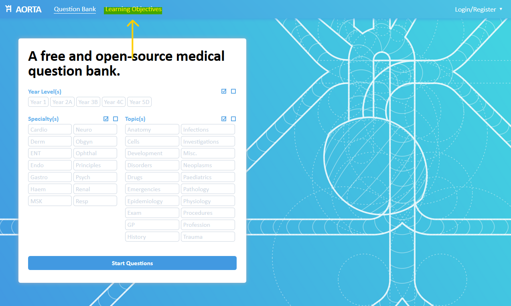
    
2. If you are logged in, you should see an "Interested in helping out?" box.
   Click on it to open it.
   
   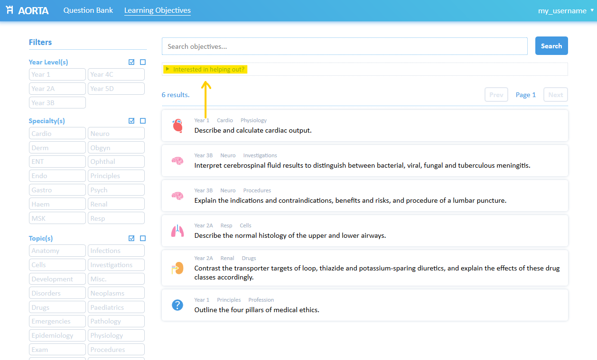
   
3. Select the appropriate year level, specialty and topic of the learning
   objective, and write the learning objective in the text box below. Once you
   are done, click *Add Learning Objective*.
   
   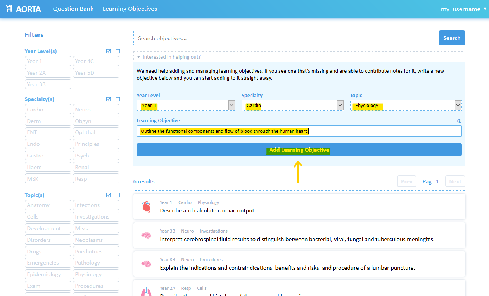

4. You should see a message indicating that the addition was successful;
   clicking on this message will take you directly to the learning objective
   page. 
   
   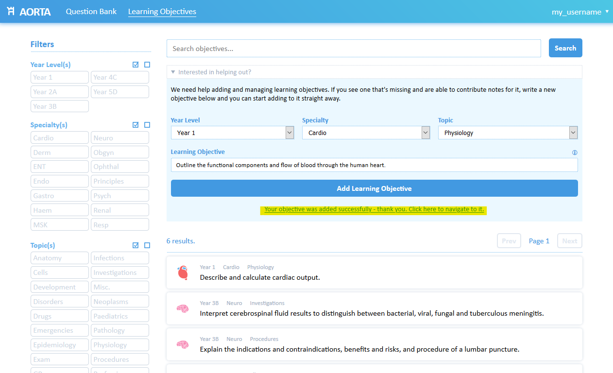

# How do I edit notes for a learning objective?

First, make sure you are logged into your account on AORTA. Only the user
assigned to a learning objective (usually the creator of the objective) can edit
its notes.

1. Find the learning objective you'd like to edit. You can search the objectives
   that you are assigned to by typing your username in the search bar and
   clicking *Search*.
   
   Once you have found the learning objective you'd like to edit, click on it to head
   to its page.
   
   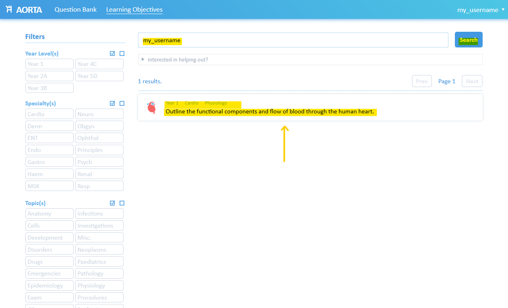
   
2. On the page for that learning objective, you will see the objective and any
   notes. By default, there will be no notes for a new objective. 
   
   To edit the notes for the objective, click on the *Edit* button on the side
   panel. This button is only visible to the user assigned to the objective.

   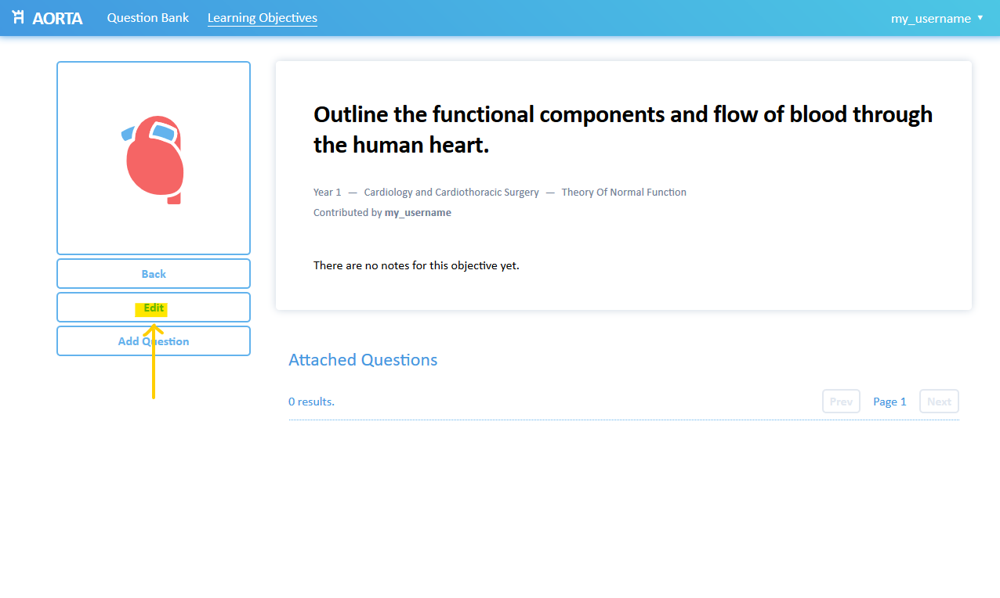
   
3. Clicking on the *Edit* button will take you to the edit interface. You can
   edit the objective itself at the top, and edit or add notes below. 
   
   **Notes you add need to be formatted using Markdown**, which is a simple
   syntax used to add formatting. If you don't want to use Markdown, you can
   just write paragraphs normally without formatting. If you want to add
   headings, bold/italics, links or images, have a look at this [Markdown cheat
   sheet](https://www.markdownguide.org/cheat-sheet/) or you can ask us
   directly. You might find it easier to draft your content in a dedicated
   Markdown editor like [StackEdit](https://stackedit.io/app#) and copy and
   paste it into the notes box.
   
   As the contributor, we are happy for you to add any details you'd like at the
   top of your notes to direct questions to. You can add your name, your email
   and/or your year level, or any other information you would like.
   
   Once you are done, click the *Save* button to save your edits.
   
   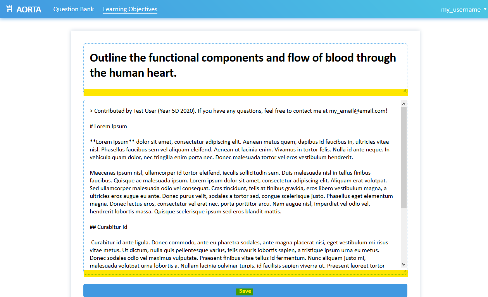
   
4. You will be taken back to the objective page; your new notes should now be
   visible with any Markdown formatting you've applied. You can repeat the
   process by clicking the *Edit* button again.
   
   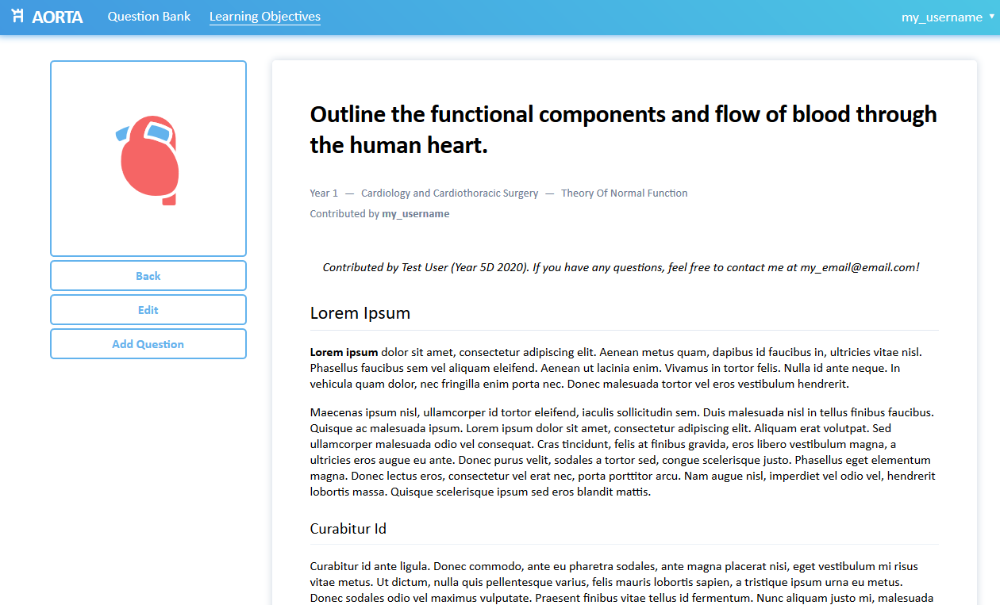
   

# How do I add a new EMQ?

First, make sure you are logged into your account on AORTA. Users can add
questions to any learning objective, not just objectives that they can edit
notes for. 

All questions **must** be added under a learning objective. If you do not find a
learning objective suitable for your question, you can add it (see [*How do I
add a learning objective?*]()). If you don't want to assume responsibility for the objective, let us know
and we can transfer the objective's edit rights to another user.

1. First, navigate to the page of the objective you'd like to add a question
   under. You can search objectives by title using the search box and/or filter
   objectives using the side panel. 
   
   Once you've found the objective you'd like to add a question for, click on it
   to head to the objective page.
   
   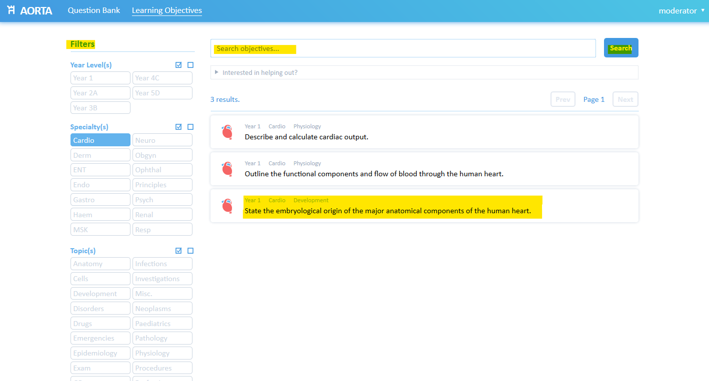
   
2. If you are logged in, you should see an *Add Question* button. Click on it to
   open the question-adding dialog.
   
   
   
3. On the question-adding dialog, enter the question stem and at least one
   correct choice and one incorrect choice ("distractor") in the appropriate
   boxes. Each choice has an optional explanation box for why it is correct or
   incorrect. You can add as many more incorrect choices as you wish. 
   
   You can format the question stem and choice explanations using Markdown if
   you would like. 
   
   Once you have finished adding the information for your question, click *Add Question*.
   
   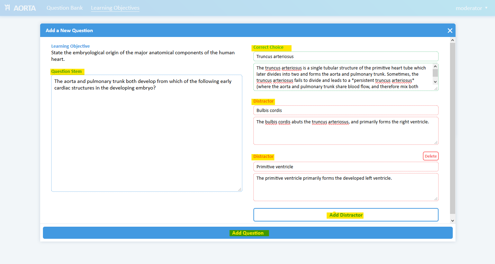
   
4. If your question was successfully added, you will get a message at the bottom
   of the dialog box indicating such, and the information you entered will
   clear. You can repeat the process to add more questions.
